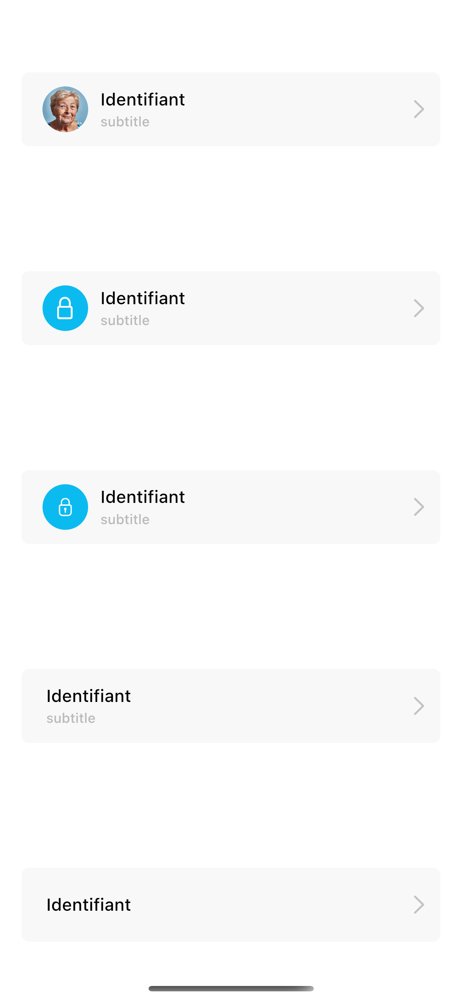

# example




```dart
 SettingsButton(
                  onClick: () => {},
                  image: NetworkImage(
                      "https://static.scientificamerican.com/sciam/cache/file/F16F988F-B16C-45D6-B6F6AD6734363BEA_source.jpg?w=590&h=800&D061FB02-A703-4A52-8D7BF1C9B520F544"),
                  // icon: Icon(
                  //   CupertinoIcons.lock,
                  //   color: Colors.white,
                  // ),
                  title: "Identifiant",
                  subtitle: "subtitle",
                  // svg: SvgPicture.asset("assets/lock.svg"),
                  iconBackgroundColor: Color(0XFF0BBBF0),
                  borderRadiusType: helper.BorderRadiusType.slightRounded,
                ),
                SettingsButton(
                  onClick: () => {},
                  icon: Icon(
                    CupertinoIcons.lock,
                    color: Colors.white,
                  ),
                  title: "Identifiant",
                  subtitle: "subtitle",
                  // svg: SvgPicture.asset("assets/lock.svg"),
                  iconBackgroundColor: Color(0XFF0BBBF0),
                  borderRadiusType: helper.BorderRadiusType.slightRounded,
                ),
                SettingsButton(
                  onClick: () => {},
                  title: "Identifiant",
                  subtitle: "subtitle",
                  svg: SvgPicture.asset("assets/lock.svg"),
                  iconBackgroundColor: Color(0XFF0BBBF0),
                  borderRadiusType: helper.BorderRadiusType.slightRounded,
                ),
                SettingsButton(
                  onClick: () => {},

                  title: "Identifiant",
                  subtitle: "subtitle",
                  // svg: SvgPicture.asset("assets/lock.svg"),
                  iconBackgroundColor: Color(0XFF0BBBF0),
                  borderRadiusType: helper.BorderRadiusType.slightRounded,
                ),
                SettingsButton(
                  onClick: () => {},
                  // image: NetworkImage(
                  //     "https://static.scientificamerican.com/sciam/cache/file/F16F988F-B16C-45D6-B6F6AD6734363BEA_source.jpg?w=590&h=800&D061FB02-A703-4A52-8D7BF1C9B520F544"),
                  // // icon: Icon(
                  //   CupertinoIcons.lock,
                  //   color: Colors.white,
                  // ),
                  title: "Identifiant",

                  // svg: SvgPicture.asset("assets/lock.svg"),
                  iconBackgroundColor: Color(0XFF0BBBF0),
                  borderRadiusType: helper.BorderRadiusType.slightRounded,
                ),
```