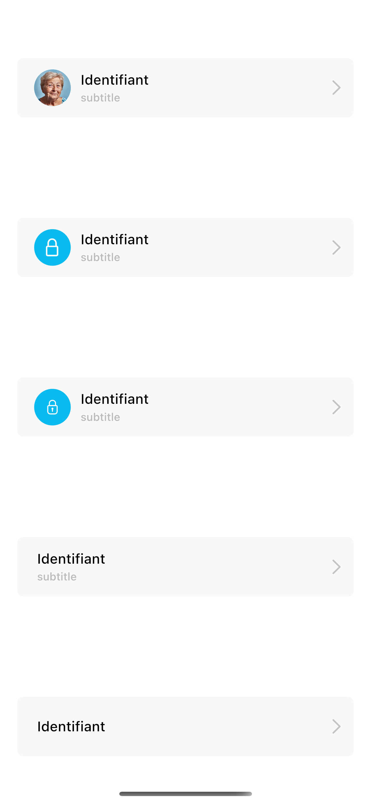

# 14. Boutons (profil/réglages)




## Installation

import package to your project.

## [example](example.md)

## Usage
Après l'initialisation de Screen_utils sur le fichier main.dart vous n'aurez plus besoin de mettre (.h | .r | .w ) sur les entrées.

## Widget SettingsButton

```dart
 final Key? key;
  final String? title;
  final String? subtitle;
  final VoidCallback onClick;
  final SvgPicture? svg;

  final ImageProvider? image;
  final Icon? icon;

  final Color? backgroundColor;
  final Color? iconBackgroundColor;
  final Color? overlayColor;
  final double? radius;
  final BorderRadiusType? borderRadiusType;
  const SettingsButton(
      {this.key,
      this.radius,
      this.svg,
      this.iconBackgroundColor,
      this.title,
      this.subtitle,
      required this.onClick,
      this.image,
      this.icon,
      this.backgroundColor,
      this.overlayColor,
      this.borderRadiusType})

      : assert(((image != null && icon == null && svg == null) ||
      // for the circular image if you want to add it, you must specify only one provider : ImageProvider or Icon or an SvgPicture
      
            (image == null && icon != null && svg == null) ||
            (image == null && icon == null && svg != null) ||
            (image == null && icon == null && svg == null)));
    

      
```
## Parameters
 
* **image, svg  or the icon :** 
  for the circular image if you want to add it, you must specify only one provider : ImageProvider or Icon or an SvgPicture

## Simple example
```dart
//
SettingsButton(
                  onClick: () => {},
                  image: NetworkImage(
                      "https://static.scientificamerican.com/sciam/cache/file/F16F988F-B16C-45D6-B6F6AD6734363BEA_source.jpg?w=590&h=800&D061FB02-A703-4A52-8D7BF1C9B520F544"),
                  // icon: Icon(
                  //   CupertinoIcons.lock,
                  //   color: Colors.white,
                  // ),
                  title: "Identifiant",
                  subtitle: "subtitle",
                  // svg: SvgPicture.asset("assets/lock.svg"),
                  iconBackgroundColor: Color(0XFF0BBBF0),
                  borderRadiusType: helper.BorderRadiusType.slightRounded,
                ),
            
```

## Contributing
Pull requests are welcome. For major changes, please open an issue first to discuss what you would like to change.

## License
[KOSMOS DIGITAL](https://www.kosmos-digital.com)